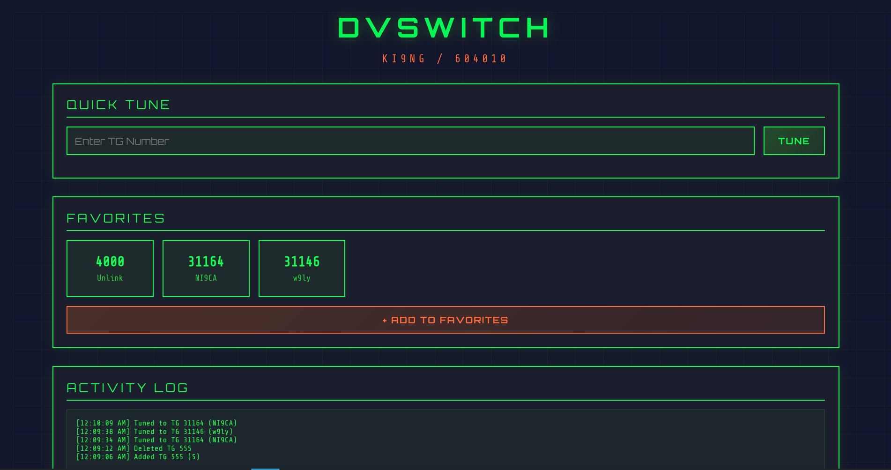

# DVSwitch Control Panel



A web-based control interface for DVSwitch Server on AllStarLink 3 (ASL3). Provides an intuitive, real-time dashboard for managing digital voice modes and talkgroups with a distinctive retro ham radio aesthetic.

## Features

- **Real-time Status Monitoring** - Live display of current mode, talkgroup, network, and callsign
- **One-Click Mode Switching** - Toggle between DMR, YSF, P25, NXDN, and D-STAR modes with visual feedback
- **Favorite Talkgroups** - Quick access buttons for your most-used talkgroups
- **Quick Tune** - Input field to instantly tune to any talkgroup without adding to favorites
- **Add to Favorites** - Web interface to add new talkgroups to your permanent favorites
- **Delete Favorites** - Remove talkgroups you no longer need
- **Activity Logging** - Real-time log of all commands and system events
- **Auto-Refresh** - Status updates every 3 seconds without page reload
- **Responsive Design** - Works seamlessly on desktop and mobile devices
- **Animated Interface** - Cyberpunk-inspired design with smooth transitions and effects

## Quick Installation

Run this one command on your AllStarLink 3 node:

```bash
curl -sSL https://raw.githubusercontent.com/ki9ng/dvswitch-control-panel/main/install-dvswitch-control.sh | sudo bash
```

That's it! After installation, access your control panel at:
```
http://YOUR_NODE_IP/dvswitch-control.html
```

## Prerequisites

- AllStarLink 3 (ASL3) running on Debian Bookworm
- DVSwitch Server installed and configured
- Apache2 web server
- Root/sudo access to your node

## Manual Installation

If you prefer to download first:

```bash
cd /tmp
wget https://raw.githubusercontent.com/ki9ng/dvswitch-control-panel/main/install-dvswitch-control.sh
sudo bash install-dvswitch-control.sh
```

## Using the Control Panel

### Mode Switching
Click any mode button (DMR, YSF, P25, NXDN, D-STAR) to switch digital modes. The active mode will be highlighted in green.

### Quick Tune
Type any talkgroup number in the "Quick Tune" field and press Enter or click TUNE. This tunes to the talkgroup immediately without adding it to favorites.

### Adding Favorites
1. Click "ADD TO FAVORITES" button
2. Enter the talkgroup number
3. Enter a name/description
4. Click "ADD FAVORITE"

The new favorite appears immediately in your grid.

### Deleting Favorites
Hover over any favorite button and click the "X" that appears in the corner to remove it.

### Switching Modes
Click any mode button (DMR, YSF, P25, NXDN, D-STAR) to change digital modes.

## Customizing Favorite Talkgroups

Your favorites are stored in:
```
/var/lib/dvswitch/dvs/tgdb/DMR_fvrt_list.txt
```

Format (use three pipes):
```
4000|||Unlink
31164|||NI9CA
3100|||USA Nationwide
31|||Worldwide
```

You can edit this file directly or use the web interface to add/remove favorites.

## Uninstalling

```bash
cd /tmp
wget https://raw.githubusercontent.com/ki9ng/dvswitch-control-panel/main/uninstall-dvswitch-control.sh
sudo bash uninstall-dvswitch-control.sh
```

## Troubleshooting

### Control Panel Not Loading

Check Apache error logs:
```bash
sudo tail -f /var/log/apache2/error.log
```

Verify files are in place:
```bash
ls -la /var/www/html/dvswitch-control.html
ls -la /var/www/cgi-bin/dvswitch-control.sh
```

### Commands Not Working

Verify CGI script is executable:
```bash
sudo chmod +x /var/www/cgi-bin/dvswitch-control.sh
```

Check CGI module is enabled:
```bash
apache2ctl -M | grep cgi
```

Restart Apache:
```bash
sudo systemctl restart apache2
```

### Status Not Updating

Verify DVSwitch services are running:
```bash
systemctl status analog_bridge
systemctl status mmdvm_bridge
systemctl status md380-emu
```

Check DVSwitch status manually:
```bash
/opt/MMDVM_Bridge/dvswitch.sh show
```

### Favorites Not Saving

Check file permissions:
```bash
sudo chmod 666 /var/lib/dvswitch/dvs/tgdb/DMR_fvrt_list.txt
```

## Architecture

### Frontend (dvswitch-control.html)
- Pure HTML/CSS/JavaScript
- No external dependencies beyond Google Fonts
- Uses Fetch API for async communication
- Auto-refresh mechanism for status updates
- Event-driven button interactions

### Backend (dvswitch-control.sh)
- Bash CGI script
- Handles command execution
- Provides favorites list API
- Add/delete favorites functionality
- Security filtering for command validation
- JSON response format

### Integration Points
- DVSwitch status API: `/dvswitch/include/status.php`
- DVSwitch control script: `/opt/MMDVM_Bridge/dvswitch.sh`
- Favorites database: `/var/lib/dvswitch/dvs/tgdb/DMR_fvrt_list.txt`

## Security Considerations

The CGI script includes security measures:
- Command validation (only allows `dvswitch.sh` commands)
- No arbitrary shell command execution
- Runs with Apache user permissions
- Input sanitization for special characters

### Additional Hardening

For production environments, consider:

1. **IP Whitelist** - Restrict access by IP in Apache config
2. **HTTP Authentication** - Add basic auth to the control panel
3. **HTTPS** - Enable SSL/TLS for encrypted connections
4. **Firewall Rules** - Limit web access to trusted networks

Example Apache IP restriction:

```apache
<Directory "/var/www/html">
    Require ip 192.168.1.0/24
    Require ip 10.0.0.0/8
</Directory>
```

## Compatibility

Tested on:
- AllStarLink 3 (Debian Bookworm)
- Raspberry Pi 3B+, 4, 5
- x86_64 systems running ASL3

Should work on any ASL3 installation with DVSwitch Server.

## Known Limitations

- DMR mode only for talkgroup tuning (by design)
- Requires DVSwitch Server (not compatible with standalone Analog_Bridge)
- Status updates require DVSwitch dashboard API to be accessible
- Browser must support ES6 JavaScript features

## Similar Projects

If you're looking for alternatives or complementary tools:

### DVSwitch Mode Switcher
**Repository:** [firealarmss/dvswitch_mode_switcher](https://github.com/firealarmss/dvswitch_mode_switcher)

A Node.js-based web interface for DVSwitch with mode switching and talkgroup selection.

**Comparison:**
- **Architecture:** Node.js backend vs our Bash CGI (simpler)
- **Installation:** Requires Node.js 18+ and npm vs our one-line installer
- **Favorites:** Static config files vs our web-based add/delete interface
- **Port:** Runs on port 3000 vs integrates with existing Apache

### Official DVSwitch Dashboard
**Built-in with DVSwitch Server**

The standard dashboard that comes with DVSwitch installation.

**What it offers:**
- Real-time activity monitoring
- RX audio streaming
- System status display

**What it doesn't:**
- No talkgroup control or mode switching
- Monitoring only, not control

### DVSwitch Mobile (DVSM)
**Official mobile apps for Android/iOS**

Native mobile applications for DVSwitch control.

**Key difference:**
- Requires mobile app installation vs browser-based access
- Not self-hostable - uses official apps

**Our advantages:**
- ✅ Simpler installation (one command)
- ✅ Pure HTML/CSS/JS - no Node.js required
- ✅ Web-based favorite management (add/delete via UI)
- ✅ Quick Tune feature for instant TG changes
- ✅ Works with standard Apache setup
- ✅ Edit favorites directly or via web interface
- ✅ Retro-styled, responsive design

## Contributing

Contributions are welcome! Please see [CONTRIBUTING.md](CONTRIBUTING.md) for guidelines.

## Changelog

See [CHANGELOG.md](CHANGELOG.md) for version history and changes.

## Credits

- Original concept and development by KI9NG
- DVSwitch Server by N4IRS and the DVSwitch development team
- AllStarLink development team for ASL3
- Ham radio community for testing and feedback

## License

MIT License - See [LICENSE](LICENSE) for details.

## Support

For support, please:
1. Check the troubleshooting section above
2. Review existing GitHub issues
3. Open a new issue with:
   - Your ASL3 version
   - Hardware platform
   - Error messages or logs
   - Steps to reproduce the problem

## Acknowledgments

Special thanks to:
- The AllStarLink development community
- DVSwitch contributors and maintainers
- Beta testers and early adopters
- Ham radio operators providing feedback

73 de KI9NG
